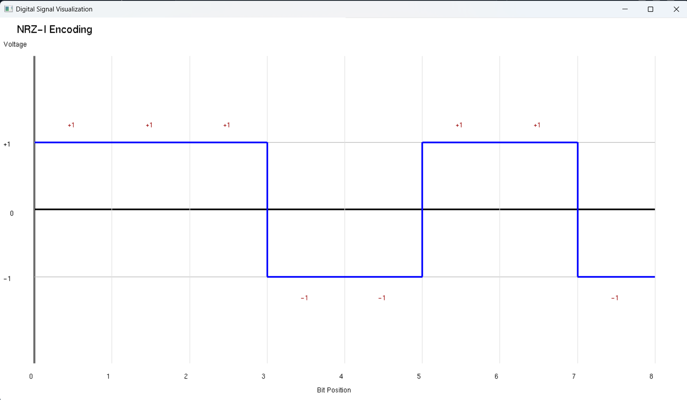
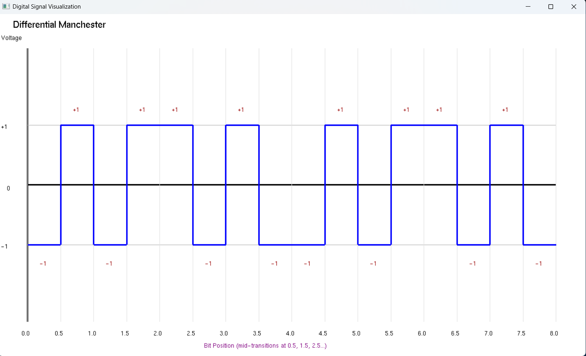

# 🚀 Digital Signal Generator

A C++ application for generating and visualizing digital signals using various line coding schemes, scrambling techniques, and modulation methods with OpenGL graphics.


## ✨ Features

- **Line Coding**: NRZ-L, NRZ-I, Manchester, Differential Manchester, AMI
- **Scrambling**: B8ZS, HDB3
- **Modulation**: PCM, Delta Modulation
- **Real-time Visualization**: Interactive OpenGL waveform display

## 🛠️ Language & Libraries

- **Language**: C++
- **Graphics**: OpenGL, FreeGLUT
- **Standard Libraries**: iostream, cstring, cmath

## 📋 Prerequisites

- MinGW/GCC compiler (C++11 or later)
- FreeGLUT library
- OpenGL-compatible graphics card

## 📦 Installation

1. Download FreeGLUT library files (already included in `GL/` folder)
2. Ensure `freeglut.dll` and `libfreeglut.a` are in the project root directory

## 🔧 Compilation

```bash
g++ signal_generator.cpp -o signal_generator.exe -L. -I. -lfreeglut -lopengl32 -lglu32
```

**Note**: The `-L.` flag points to the current directory where `libfreeglut.a` is located.

## ▶️ Execution

```bash
./signal_generator.exe
```

Or simply double-click `signal_generator.exe` in Windows Explorer.

## 📖 Usage Examples

### Example 1: NRZ-I Encoding

Binary Data: 10010101




---

### Example 2: Differential Manchester


Binary Data: 10101010




---

## 📁 Project Structure

```
dc-assignment/
├── GL/                          # OpenGL/FreeGLUT 
├── Output-Images/               # Output screenshots
│   ├── diffrential-manchester.png
│   └── nrz-i.png
├── signal_generator.cpp         # Main source code
├── signal_generator.exe         # Compiled executable
├── freeglut.dll                 # FreeGLUT dynamic 
├── libfreeglut.a                # FreeGLUT static 
└── README.md                    # This file
```

## 🐛 Troubleshooting

**Issue**: `freeglut.dll not found`
- **Solution**: Ensure `freeglut.dll` is in the same directory as `signal_generator.exe`

**Issue**: Linker error `cannot find -lfreeglut`
- **Solution**: Use `-L.` flag to point to current directory:
  ```bash
  g++ signal_generator.cpp -o signal_generator.exe -L. -I. -lfreeglut -lopengl32 -lglu32
  ```

**Issue**: OpenGL window doesn't appear
- **Solution**: Update graphics drivers and ensure OpenGL support is enabled

**Issue**: Compilation error with GL headers
- **Solution**: Verify `GL/` folder contains proper FreeGLUT headers

## 📄 License

Open-source project for educational purposes.
